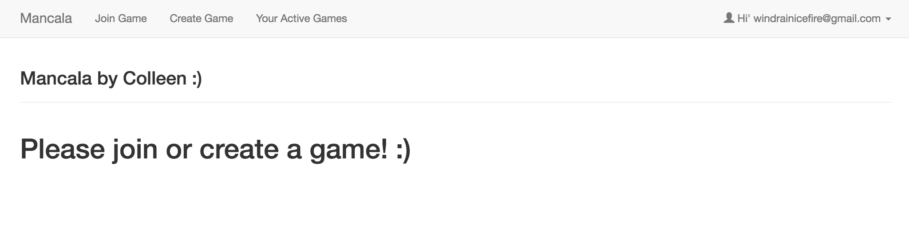
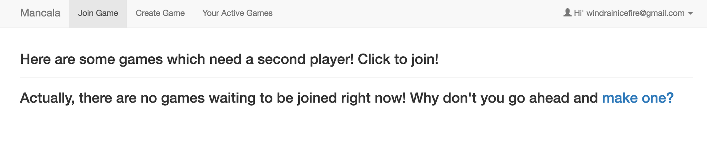
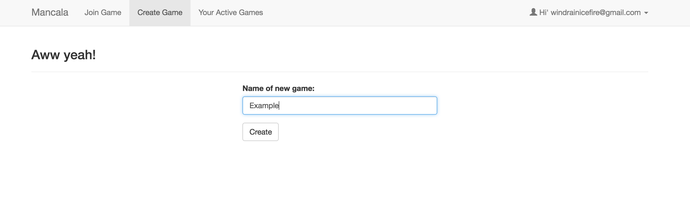
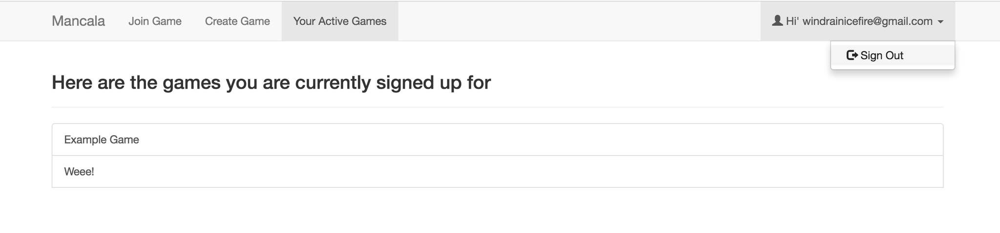
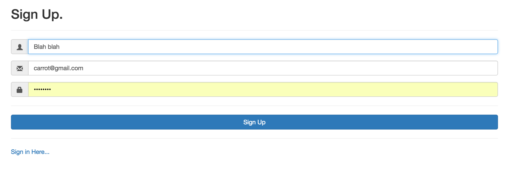
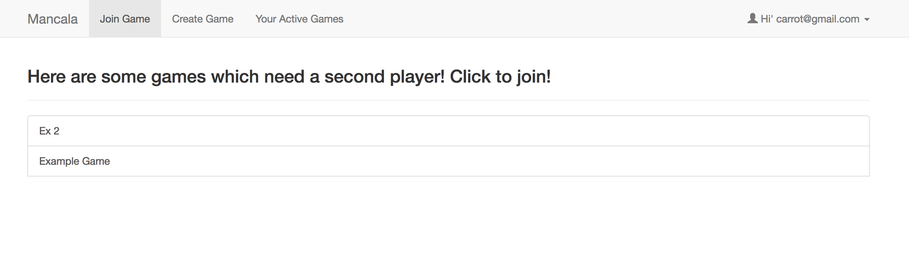
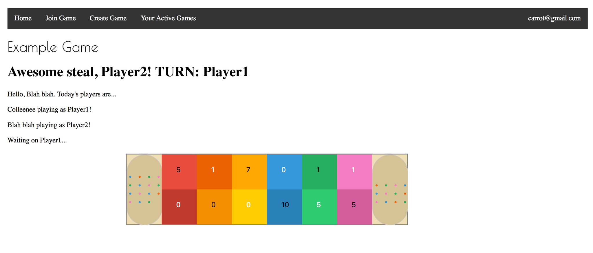

## Mancala!

An online, multiplayer Mancala game made with pure PHP. Connected to a MySQL database. 

This site is live at http://web.engr.oregonstate.edu/~minorc/

View the codepen demo at https://codepen.io/RainbowBright/full/PzgGRL/

Sign up and create and play as many games as you want! 

This code is based on the most popular Western variant of Mancala called Kalah:
https://en.wikipedia.org/wiki/Kalah#Rules

To create the tables to connect this to your own database, use Mancala.sq and user.sql. 

The CSS for the gameboard page is in style.css and menu-bar-css.css. The rest of the site uses bootstrap and jquery. 

###Screenshots
___

***

***

***

***

***

***

***
